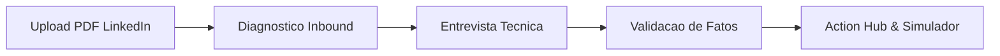

# LinkeGringo

[](https://github.com/Muriel-Gasparini/linkegringo/actions/workflows/deploy.yml)
[](https://github.com/Muriel-Gasparini/linkegringo/actions/workflows/ci.yml)
[](https://github.com/Muriel-Gasparini/linkegringo/releases)
[](https://opensource.org/licenses/MIT)
[](https://www.typescriptlang.org/)
[](https://react.dev/)
[](https://ai.google.dev/)
[](#privacidade-em-primeiro-lugar-byok-100-client-side)

> **Otimizador de perfil do LinkedIn para os critérios de busca e conversão de recrutadores técnicos dos Estados Unidos.**  
> 100% Client-Side • Bring Your Own Key (BYOK) • Auditoria no DevTools • Gratuito & Open Source.

**Aplicacao no ar:** [https://muriel-gasparini.github.io/linkegringo/](https://muriel-gasparini.github.io/linkegringo/)

---

## O Que e o LinkeGringo?

Muitos engenheiros de software brasileiros altamente qualificados permanecem invisiveis para recrutadores dos Estados Unidos. O motivo central nao e a competencia tecnica, mas o **padrao de apresentacao profissional**:
- Descricoes passivas focadas em atribuicoes ("Participei do desenvolvimento de...").
- Ausencia de contexto de impacto mensuravel, escala de trafego e decisoes de arquitetura.
- Inseguranca na formulacao em ingles tecnico idiomático.

O **LinkeGringo** resolve essa barreira atraves de um pipeline estruturado de IA que analisa o PDF original do perfil, identifica pontos criticos de triagem, conduz uma entrevista tecnica adaptativa e produz uma reescrita integral alinhada aos padroes de contratacao dos EUA, acompanhada de checklist operacional.

---

## Privacidade em Primeiro Lugar (BYOK 100% Client-Side)

Diferente de plataformas SaaS que centralizam perfis profissionais em servidores proprietarios:
1. **Zero Backend**: Toda a aplicacao roda exclusivamente no navegador do usuario como Single Page Application (SPA).
2. **Bring Your Own Key (BYOK)**: Cada usuario utiliza sua propria chave gratuita da API do **Google Gemini** (Google AI Studio).
3. **Privacidade Auditavel**: As unicas requisicoes de rede sao enviadas diretamente do navegador para os servidores oficiais da Google (`generativelanguage.googleapis.com`), passiveis de inspecao na aba *Network* do DevTools.
4. **Armazenamento Local**: A chave de API permanece gravada apenas no `localStorage` do proprio dispositivo e jamais e compartilhada com terceiros.

---

## Jornada do Usuario



1. **Upload Direto do LinkedIn**: Arraste o arquivo exportado atraves da opcao "Salvar como PDF" do seu perfil.
2. **Diagnostico Inbound**: Metrica ponderada de *Inbound Readiness*, funil de retencao (Busca -> Card -> Perfil -> InMail) e identificacao do principal gargalo.
3. **Entrevista Tecnica Adaptativa**: Perguntas direcionadas para elucidar metricas reais, limites de escala e escolhas arquiteturais.
4. **Confirmacao de Fatos**: Revisao explicita dos fatos tecnicos consolidados para assegurar fidelidade total e zero alucinacoes.
5. **Action Hub (3 Abas)**:
   - **My Profile**: Card comparativo do LinkedIn Recruiter (Antes vs Depois) e secoes prontas para transferencia (Headline, About, Experiencias e Skills) com contadores de caracteres.
   - **Search**: Simulador de busca de recrutadores com termos-chave (MATCH, WEAK, MISSING) e correcao integrada.
   - **Launch**: Checklist das configuracoes externas essenciais no LinkedIn (Open to Work, 5 cargos-alvo, localizacao remota e perfil secundario em ingles).

---

## Quickstart (Como Rodar Localmente)

### Pre-requisitos
- Node.js `>= 22`
- pnpm `>= 11`

### 1. Clonar e Instalar
```bash
git clone https://github.com/Muriel-Gasparini/linkegringo.git
cd linkegringo
pnpm install
```

### 2. Executar em Desenvolvimento
```bash
pnpm dev
```
Acesse `http://localhost:5173` no navegador.

---

## Como Obter a Chave Gratuita do Google Gemini

1. Acesse o [Google AI Studio](https://aistudio.google.com/).
2. Efetue login com uma conta Google.
3. Selecione a opcao **"Get API key"** (Criar Chave de API).
4. Copie a chave gerada e informe-a na interface de configuracao do LinkeGringo.

---

## Como Exportar o PDF do seu LinkedIn

1. Acesse seu perfil no [LinkedIn](https://www.linkedin.com/in/me/).
2. Clique no botao **Mais** (ou *More*) situado abaixo do seu nome e headline.
3. Selecione a opcao **"Salvar como PDF"** (ou *Save to PDF*).
4. Submeta o arquivo resultante na area de upload do LinkeGringo.

---

## Estrutura do Repositorio (Monorepo)

```
linkegringo/
├── packages/
│   ├── core/       # @linkegringo/core — Dominio, Schemas Zod, tipos e formulas deterministicas
│   ├── ai/         # @linkegringo/ai   — Provedor Gemini (@google/genai), Mock offline e prompts
│   └── mcp/        # @linkegringo/mcp  — Servidor MCP oficial (stdio) & Chrome DevTools Hub
├── apps/
│   └── web/        # @linkegringo/web  — SPA React 19 + Vite + Tailwind CSS v4
├── .github/        # Workflows CI/CD (Deploy GitHub Pages e CI de Pull Requests)
└── docs...
```

---

## Model Context Protocol (MCP)

O LinkeGringo possui um servidor MCP oficial publicado no registro público do NPM ([`@linkegringo/mcp`](https://www.npmjs.com/package/@linkegringo/mcp)). Ele opera **100% autônomo** (sem necessidade de clonar o repositório ou de API Keys externas) fornecendo ferramentas determinísticas para agentes de IA locais:

```bash
# Instalador universal automático (Google Antigravity, Claude Desktop, Cursor AI):
npx -y @linkegringo/mcp install

# Comandos One-Line diretos para agentes de terminal (CLI):
agy mcp add linkegringo npx -y @linkegringo/mcp
codex mcp add linkegringo -- npx -y @linkegringo/mcp
claude mcp add linkegringo npx -y @linkegringo/mcp
goose configure --add-extension "npx -y @linkegringo/mcp"
```

---

## Scripts Disponiveis

```bash
# Iniciar o servidor de desenvolvimento
pnpm dev

# Compilar todos os pacotes e aplicacao web
pnpm build

# Executar checagem estatica de tipos
pnpm typecheck

# Executar testes automatizados
pnpm test

# Publicar nova versão do @linkegringo/mcp no NPM
pnpm release:mcp [patch|minor|major]
```

---

## Como Contribuir

Contribuicoes sao bem-vindas. Consulte o arquivo [CONTRIBUTING.md](CONTRIBUTING.md) para detalhes sobre padroes de codigo, procedimentos de teste e submissao de mudancas.

---

## Codigo de Conduta

Este projeto adota o [Contributor Covenant](CODE_OF_CONDUCT.md). Ao participar deste projeto, espera-se que todas as pessoas respeitem seus termos.

---

## Seguranca e Privacidade

Consulte as diretrizes e procedimentos de reporte em [SECURITY.md](SECURITY.md).

---

## Licenca

Distribuido sob a licenca **MIT**. Consulte o arquivo [LICENSE](LICENSE) para mais informacoes.  
Mantido por **Muriel Gasparini**.
